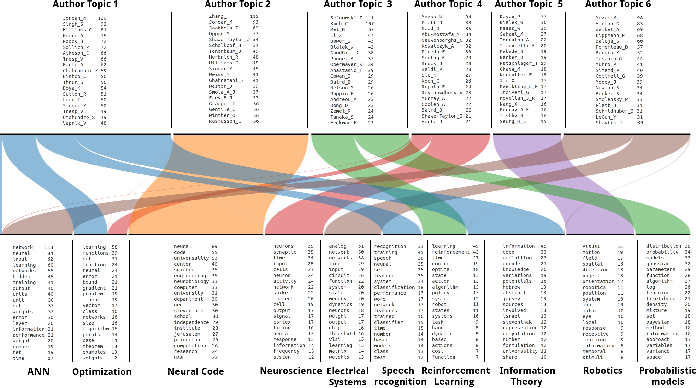

# DT2B

---------------------------
Dual Topics to Bicluster Model
---------------------------

Daniel Rugeles and Kaiqi Zhao
daniel007[at]ntu.edu.sg

(C) Copyright 2016, Daniel Rugeles and Kaiqi Zhao

Permission is hereby granted, free of charge, to any person obtaining a copy of this software and associated documentation files (the "Software"), to deal in the Software without restriction, including without limitation the rights to use, copy, modify, merge, publish, distribute, sublicense, and/or sell copies of the Software, and to permit persons to whom the Software is furnished to do so, subject to the following conditions:

The above copyright notice and this permission notice shall be included in all copies or substantial portions of the Software.

THE SOFTWARE IS PROVIDED "AS IS", WITHOUT WARRANTY OF ANY KIND, EXPRESS OR IMPLIED, INCLUDING BUT NOT LIMITED TO THE WARRANTIES OF MERCHANTABILITY, FITNESS FOR A PARTICULAR PURPOSE AND NONINFRINGEMENT. IN NO EVENT SHALL THE AUTHORS OR COPYRIGHT HOLDERS BE LIABLE FOR ANY CLAIM, DAMAGES OR OTHER LIABILITY, WHETHER IN AN ACTION OF CONTRACT, TORT OR OTHERWISE, ARISING FROM, OUT OF OR IN CONNECTION WITH THE SOFTWARE OR THE USE OR OTHER DEALINGS IN THE SOFTWARE.

------------------------------------------------------------------------

TABLE OF CONTENTS

A. EXPLANATION

B. CONTENT

C. COMPILING

D. DATA FORMAT

E. MODEL EXECUTION

------------------------------------------------------------------------

A. CONTENT

DT2B is a probabilistic model with the following specification:  

Input: 
- Instances of two variables.  

Output: 
- Topics of the first variable.  
- Topics of the second variable.     
- Relationship between the topics.  

Comments:
- The relationship between the two variables must be many-to-many. eg. <Users, Places> , <Users, Movies>, <Genes and Samples> ...               
- The clusters are given as distributions over the variables. This is the same description used by the mixture models.
              
DT2B may be used as:  

1. Biclustering algorithm.
2. Categorical Mixture model of two dependent random variables.  
3. Model the joint probability of two sparse random variables. 
4. Part of a more complex model.  

------------------------------------------------------------------------

B. CONTENT

| File        | Description           | 
| ------------- |-------------| 
| Extended_Report.pdf      | Detailed explanation of the model | 
| main.py      | Parses the input arguments and starts the inference process.     |   
| ymm.py | Interface between python and C.     |   
| aux.py | Includes auxiliary functions.      |   
| C/ | Directory including the inference process written in C.      |   
| data.csv | Sample <Author, Word> pairs taken randomly from  [NIPS](http://www.datalab.uci.edu/author-topic/NIPs.htm) dataset.        |   

------------------------------------------------------------------------  

C. COMPILING  

Navigate inside the directory called C and Type "make" in a shell.   

------------------------------------------------------------------------  

D. DATA FORMAT  

i) The file must be a csv file with no header.   
ii) Every row represents a <Variable 1, Variable 2> instance.    

For example:  

James,McDonalds  
James,Home  
James,Restaurant  
James,Gym  
John,Subway  
...  

------------------------------------------------------------------------  

E. MODEL EXECUTION  

The command to estimate a model is:  

Usage: main.py [Options] 

| Options:        | Description           | 
| ------------- | -------------| 
|  -h, --help             | Show this help message and exit  |
|  -f FILENAME            | Filename of the dataset  |
|  --alpha=ALPHA          | Parameter alpha  |
|  --beta_user=BETA_USER  | Parameter beta_user  |
|  --beta_place=BETA_PLACE| Parameter beta_place  |
|  --ku=KU                | Number of user-topics    |
|  --kp=KP                | Number of place-topics  |
|  -n N                   | Print the first n-most representive topics  |
|  -i ITERATION           | Iteration count  |
|  -v                     | Print the user-topics, place-topics and their interrelation  |
|  --seed=SEED            | Random seed  |
 
For example: 

To extract five user-topics and five place-topics given the file data.csv as input, we use:

$ python main.py -v -f data.csv --ku 5 --kp 5 

------------------------------------------------------------------------

